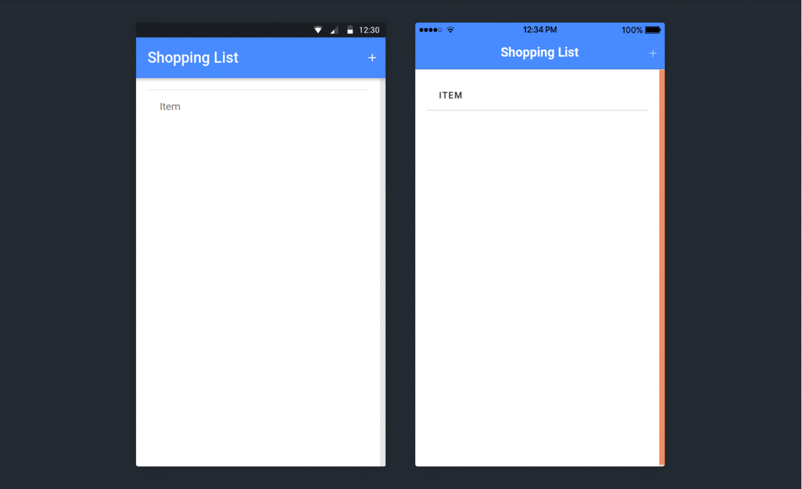

<p align="center">
  <a href="" rel="noopener">
 </a>
</p>

<h3 align="center">Cross Platform App with Firebase Connectivity.Potential to do CRUD operation on shopping list.Anytime Anywhere add on item to your list.Have a watch on your list edit it and delete when done.Similar Usage can be done for group task distribution</h3>

------------------------------------------
### Features
Everything at live instant anywhere
<br>
-Add item
-Update Item
-View Item
-Delete Item
<h3 > Shopping List As Cross Platform App </h3>
<br>
<p align="center">

</p>
</div>

#### Cross Platform App

- `Ionic` : Ionic is a complete open-source SDK for hybrid mobile app development.
------------------------------------------
### Installation

* Install dependencies
```sh
        $ git clone https://github.com/priyamshah112/Ionic-Projects.git
```
* Use requirements.txt
```
  $ npm install requirements.txt
```
